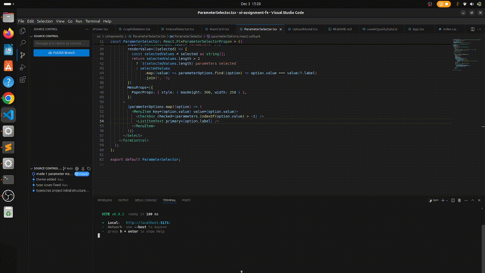

# Air Quality API

## Description

The Air Quality API is designed to ingest and query air quality data for analysis and visualization. This project provides endpoints to upload air quality datasets in CSV format and query the ingested data based on date range, parameters, and interval.

## Demo


---

## Prerequisites

1. Node.js (>=16.0)
2. npm (>=8.0)
3. SQLite (or compatible database engine configured in `prisma/schema.prisma`)

---

## Installation

1. Clone the repository:
   ```bash
   git clone https://github.com/sharmaraju352/oi-be
   cd oi-be
   ```
2. Install dependencies:
   ```bash
   npm install
   ```
3. Set up the environment variables:
   - Create a `.env` file in the root directory.
   - Copy the contents of `.env.development.local` into `.env`.

---

## Database Setup

1. Run the Prisma migration to set up the database schema:
   ```bash
   npm run prisma:migrate
   ```

---

## Running the Application

### Development Mode

To start the application in development mode:

```bash
npm run dev
```

### Production Mode

To build and run the application in production mode:

```bash
npm start
```

---

## API Usage

### 1. Ingest Air Quality Data

To upload and ingest air quality data in CSV format, use the following API:

```bash
curl --location 'localhost:5000/air-quality/ingest' \
--form 'file=@"/path-to-csv-file/AirQualityUCI.csv"'

- The file `AirQualityUCI.csv` is present in the root directory of the folder and can be used for this API.
```

- **Note**: Ensure that the file being uploaded is in CSV format and adheres to the expected structure.

---

### 2. Query Air Quality Data

To fetch air quality data based on date range, parameters, and interval, use the following API:

```bash
curl --location 'http://localhost:5000/air-quality?parameters=co_gt&startDate=2005-04-04&endDate=2005-04-04&interval=hourly'
```

#### Parameters:
- **`parameters`**: Comma-separated list of parameters to fetch (e.g., `co_gt`, `pt08_s1_co`).
- **`startDate`**: Start date of the range (format: `YYYY-MM-DD`).
- **`endDate`**: End date of the range (format: `YYYY-MM-DD`).
- **`interval`**: Data aggregation interval (`hourly` or `daily`).

#### Behavior:
- When the date range is more than 5 days, `daily` interval data is fetched.
- For shorter date ranges, `hourly` interval data is returned. This ensures efficient performance for visualizing large datasets over extended periods.

---

## Notes

- This project uses SQLite as the default database. Modify the `prisma/schema.prisma` file if you want to use a different database engine.

